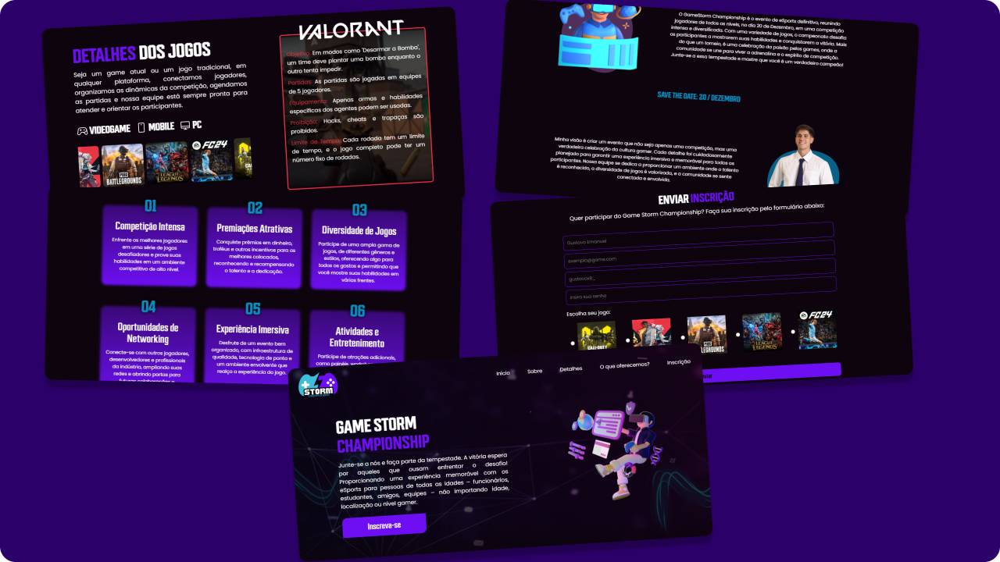

# 🎮 Game Storm Championship

A Game Storm Championship é um sistema web responsável pelo controle das inscrições de um campeonato de jogos eletrônicos, desenvolvido em ReactJS + TypeScript. Ele proporciona uma interface agradável e intuitiva para o usuário.



## 🚀 Funcionalidades

- **Regras dos Jogos**: Após selecionar um jogo, o usuário poderá verificar quais são as regras daquele jogo para o campeonato.
- **Enviar Inscrição**: Com um formulário validado, o usuário conseguirá se inscrever no campeonato.

## 📝 Bibliotecas

- **Styled-Components**: Usado para estilização de componentes.
- **Phosphor-React**: Responsável pelos ícones do sistema.
- **React-Hook-Form e Zod**: Usados para validação dos formulários de cadastro.
- **React-Router-Dom**: Responsável pelas rotas do sistema.

## 🖥️ Como rodar o projeto

Faça clone do projeto.
```tsx
git clone https://github.com/GustavoeDev/game-storm-championship-react-ts.git
````

Baixe as dependências
```tsx
npm install
````

Inicialize o projeto
```tsx
npm run dev
````
